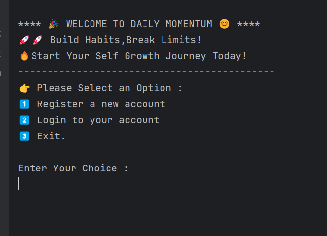
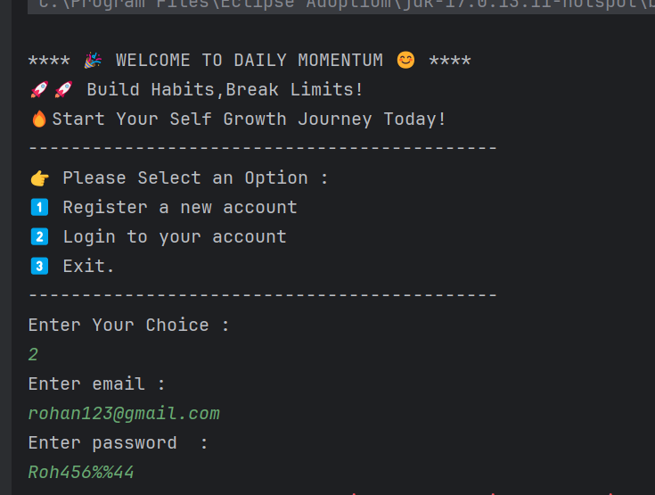
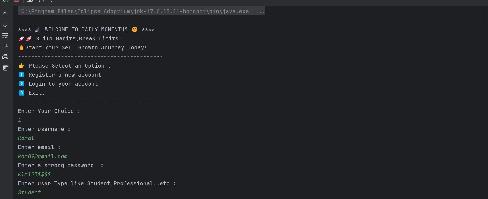
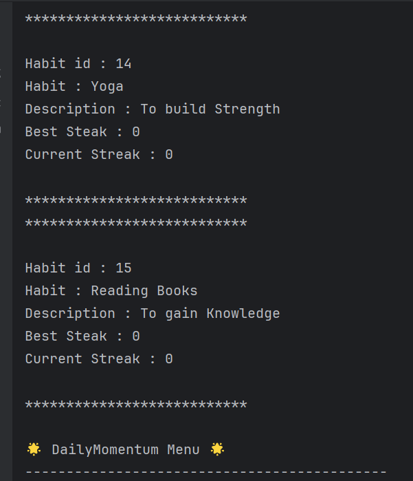
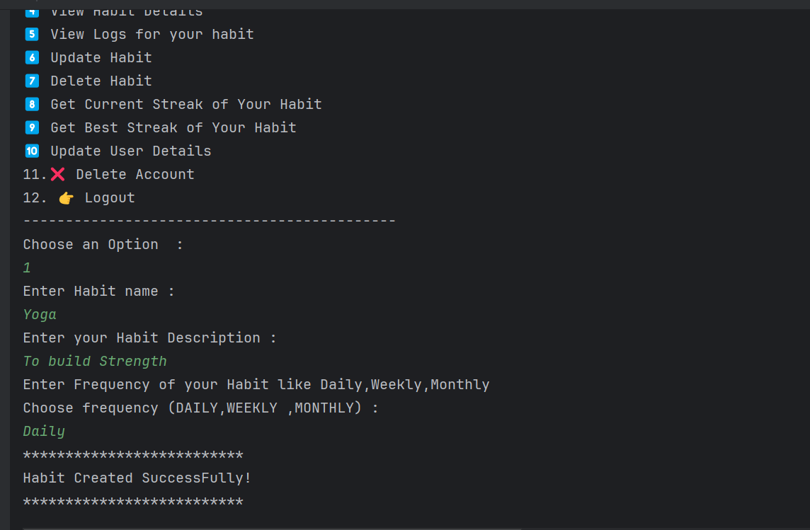
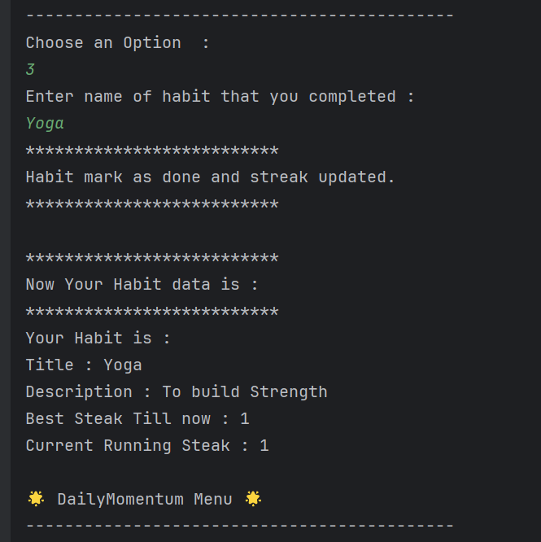

# DailyMomentum 🏃‍♂️💡


**DailyMomentum** is a Java-based Habit Tracker application inspired by **James Clear's Book ATOMIC HABITS** that helps users build productive habits, track daily/weekly/monthly streaks, and maintain consistency in achieving personal goals. It leverages **Hibernate ORM** for seamless database operations and provides a **robust, user-friendly CLI experience**.

---

## 🚀 Features

- **User Management**
    - Register and login securely
    - Password strength validation
- **Habit Management**
    - Create, update, and delete habits
    - Assign frequency: Daily, Weekly, Monthly
    - Track current streaks and best streaks
- **Habit Logs**
    - Maintain daily habit completion logs
    - Automatic streak updates
- **Robust Exception Handling**
    - Handles invalid inputs, constraint violations, and runtime errors gracefully
- **User-friendly CLI**
    - Simple menu-driven interface
    - Habit creation and tracking without remembering IDs

---

## 🛠 Technologies Used

- **Java 17** – Core programming language
- **Hibernate ORM 5.x** – For database mapping
- **MySQL 8** – Relational database
- **Maven** – Project build and dependency management

---

## 📂 Project Structure

````
DailyMomentum/
│
├── src/
│ ├── entity/ # User, Habit, HabitLog classes
│ ├── dao/ # BaseDao and DAO interfaces
│ ├── daoImpl/ # DAO implementations
│ ├── service/ # Service interfaces
│ ├── serviceImpl/ # Service implementations
│ ├── ui/ # Main menu and CLI interface
│ └── util/ # Hibernate utility classes
│
├── pom.xml # Maven configuration
├── README.md
└── hibernate.cfg.xml # Hibernate configuration

````

````
flowchart 

A[👤 User] -->|Input| --> B[UI Layer]
B --> C[Service Layer]
C --> D[DAO Layer]
D --> E[(Database)]

C --> F[⚠ Exception Handling]
C --> G[📊 Business Logic]


````

✅ UI Layer – Console-based menus (login, register, habit management)

✅ Service Layer – Core business logic (validations, habit streaks)

✅ DAO Layer – Database operations via Hibernate ORM

✅ Database – Stores Users, Habits, and HabitLogs

✅ Exception Handling – Ensures smooth execution without crashes


## 💻 How to Run

1. **Clone the repository**

```bash
1.git clone https://github.com/yourusername/DailyMomentum.git
cd DailyMomentum
```
**2. Setup Database** 

- Create a MySQL database named dailyMomentum

- Update database credentials in hibernate.cfg.xml

**3. Build Project with Maven**
- mvn clean compile

**4. Run Application**

- Run Main.java

- Follow the menu to register/login and start tracking habits

## 🎯 Usage Example

- Register as a new user

- Create a habit: "Solve 1 DSA problem daily" with frequency DAILY

- Mark habit as done each day

- Track streaks and view best streaks anytime

## ⚡ Screenshots
Here’s a quick look at the DailyMomentum app in action:

### 1. Home / Welcome Screen



### 2. Login & Registration
 


*User can login or register to start tracking habits.*

### 2. Habit Dashboard
 

*Shows all habits, current streaks, and best streaks for the logged-in user.*

### 3. Creating a Habit


*User can add a new habit by entering title, description, and frequency.*

### 4. Habit Completion & Streaks
  

*Mark habits as done, and the streaks get updated automatically.*


## 💡 Future Enhancements

🌐 Web interface using Spring Boot + React

🔔 Notifications / Reminders for habits

📊 Dashboard with charts and progress analytics

📤 Export habit data to CSV/Excel


##  👤 Author

- **Name :** Rakhi Dixit
- **Email:** rakhidixit795@gmail.com
- **GitHub:** [Rakhi-Dixit03](https://github.com/Rakhi-Dixit03)
- **LinkedIn:** [LinkedIn](https://www.linkedin.com/in/rakhidixit11/)


##  Contributions are always welcome!
**Fork the repo, create a branch, and submit a pull request 🚀**